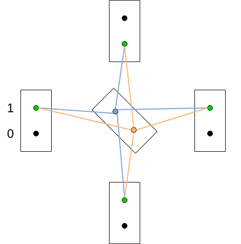
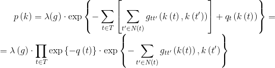
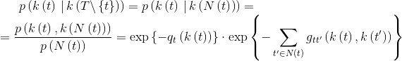

# Black and white image denoising with Gibbs sampler

## How to use

Activate the working environment using

```bash
pipenv shell
```

Specify all parameters in `config.ini` file.
From the parent directory run

```bash
python gibbs_sampling.py
```

Deactivate the environment using

```bash
exit
```

## Problem formulation

There is a true image of black and white pixels `k in {0, 1}^T`,
where `T = {(i, j) | 0 <= i < image_height, 0 <= j < image_width}`
is a set of all pixels.
This image is noised so that each pixel inverts color with probability `epsilon`.
After adding noise the color of pixel `t` is
`x(t) = 1 - k(t)` with probability `epsilon` and
`x(t) = k(t)` with probability `1 - epsilon`.
Using Gibbs sampler it is needed to remove noise from the image.

## Grid graph

Each pixel is a graph node.
It a node is not on the image edge, it has 4 neighbors:
- left: `0`
- top: `1`
- right: `2`
- bottom: `3`

A set of neighbors of node `t` is `N(t)`.

Each node has two labels: `0` (black color) and `1` (white color).
Node weight equals `q_t(k) = -log(1 - epsilon)` if `x(t) = k` and
`q_t(k) = -log(epsilon)` if `x(t) != k`.

There are edges between all neighbor nodes connecting all labels.
Edge weight is `0` if it connects the same labels and
`beta` if the labels are different:
`g_{tt'}(k(t), k(t')) = 0` if `k(t) = k(t')` and
`g_{tt'}(k(t), k(t')) = beta` if `k(t) != k(t')`, where `beta in [0.7, 2.0]`.

## Image generation

To generate an image run
```bash
python image_generation image_height image_width edge_weight epsilon
```
from `src/` directory.

Firstly, a random image is generated with discrete uniform distribution.
This image contains `0` and `1` in each cell with probability `0.5`.

Then the image is sampling.
One iteration of sampling is the next.
We fix an image and go through each pixel.



For a pixel we calculate `a = zero_weight` (sum of yellow edges)
and `b = unit_weight` (sum of blue edges).
Then `t = exp(-a) / (exp(-a) + exp(-b))`.
We generate a random number `x` from uniform distribution `U([0, 1])`.
If `x < t`, then `0` label is fixed in the pixel.
If `x >= t`, then `1` label is fixed in the pixel.

After proceeding this for all pixels many times image obtains noise:
each pixel changes its color with probability `epsilon.`

## Gibbs sampler

For such structures, the probability distribution is exponential:



where `lambda(g)` is a normalization factor.

Probability of a label `k(t)` in node `t`
with fixed labeling depends only from labels of neighbor nodes



Firstly, random labeling (image) is generated `{k(t) | t in T}`.

Then, for each object `t in T` a label `k(t)` is sampled from distribution `p(k(t) | k(N(t)))`.
This step is repeated while not more than `changes_threshold`% have changed
after the iteration of Gibbs sampling.

## Getting result

After some number of iterations, we memorize the result of each `n`th iteration.
Then the most common color is defined for each pixel.
It would be a result.

## Testing

To test some functions without using random numbers run
```bash
pytest
```
from the `test` directory.
