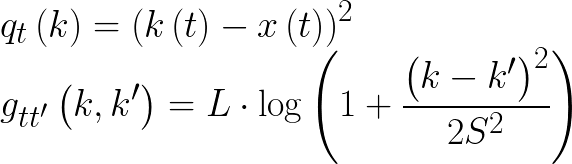

# Greyscale image denoising with max flow

## How to use

Install the working environment using `Pipenv` file with

```bash
pipenv install
```

and activate it using

```bash
pipenv shell
```

From the parent directory run

```bash
python src/gibbs_sampling.py path_to_image
```

Deactivate the environment using

```bash
exit
```

## Problem formulation

For some greyscale images apply:
* Laplacian noise
* Gaussian noise
* Salt-and-pepper noise
with different parameter values.

When applying noise, pixel intensities, which are out of range,
should be set into `0` or `255`.

On the resulted image solve `(max, +)` problem with the next weight functions:


where
* `k(t) ∈ [0, 255]` is a label of pixel `t` from the last iteration. For the first iteration it is an intensity of pixel `t` of the noised image
* `x(t) ∈ [0, 255]` is an intensity of pixel `t` of the noised image

Use α-expansion to "convert" the problem into `(max, +)` problem with two labels and apply the max flow algorithm for its solution.

## Grid graph

Each pixel is a graph node.
It a node is not on the image edge, it has 4 neighbors:
- left: `0`
- top: `1`
- right: `2`
- bottom: `3`

A set of neighbors of node `t` is `N(t)`.

Each node has `256` labels that are correspondent to colors on
the greyscale image.
